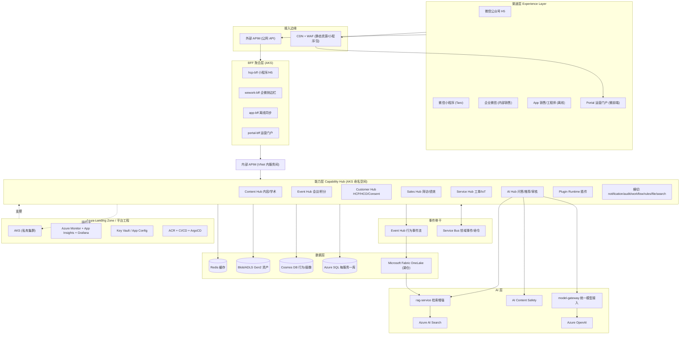
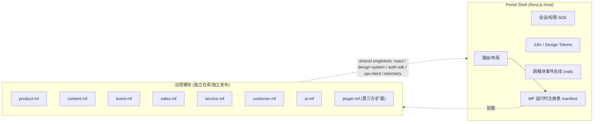
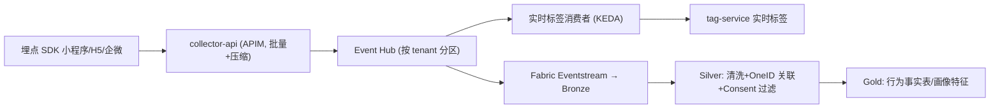
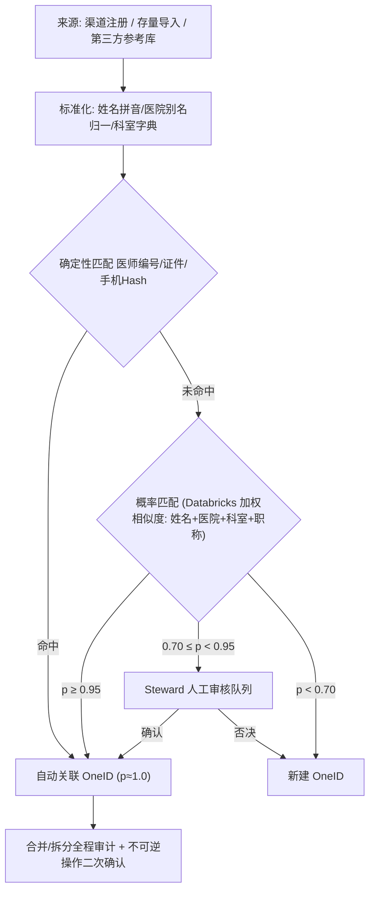
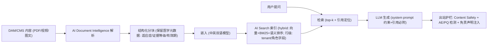
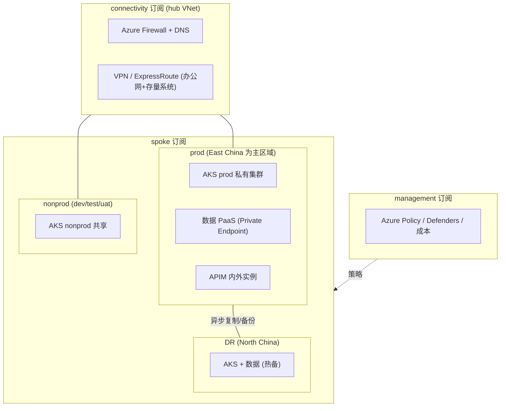
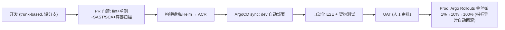

# One-Abbott 共享应用平台 · 技术架构设计（v1.0）

> 本文档基于 `archi.md`（初步架构描述）进行解读与深化，聚焦**技术架构（Technology Architecture）**的落地设计，作为后续 ADR（架构决策记录）、详细设计与 Phase 1 启动的技术基线。
>
> 阅读顺序建议：第 1 章理解输入与挑战 → 第 2 章总体架构与决策 → 按角色跳转（前端→4，后端→5/6/7，数据→8，AI→9，平台/运维→10，安全合规→11）。

---

## 1. archi.md 解读与关键技术挑战

### 1.1 从业务诉求到技术诉求的翻译

| archi.md 关键词 | 技术含义（本设计要解决的问题） |
|---|---|
| Build Once, Reuse Everywhere | 能力以 **API + 事件 + 前端模块** 三种形态复用；渠道层只做 BFF 聚合，不重复实现业务 |
| Micro Frontend（Portal Shell + 8 个 MF） | 多团队独立交付前端的**工程体系**：模块契约、共享依赖治理、独立部署、运行时注册与灰度 |
| Event Driven | 事件骨干（双通道）、事件目录与 Schema 演进规则、Outbox/幂等/对账等最终一致性保障 |
| HCP Pool / OneID / Consent | 主数据管理（MDM）+ 身份归一（匹配/合并）+ **同意管理（PIPL 强制）** |
| AI First | 统一模型网关（可切换、可审计、可计量）+ RAG 管道 + **医药场景 AI 治理**（医学审核、AE 捕获） |
| Plug-in Architecture | 插件运行时：前端 MF + 后端插件 API + 权限/生命周期声明，失败可降级 |
| Capability First（七大 Hub） | 按限界上下文拆分服务，Hub = AKS 命名空间 + API 产品 + 事件域 + 数据库的**四位一体** |

### 1.2 关键技术挑战（T1–T8）

| # | 挑战 | 说明 |
|---|---|---|
| T1 | 中国区云与模型可用性 | Azure OpenAI 不在世纪互联运营的 Azure 中国区提供；需明确全球 Azure vs 中国区 + 数据出境合规路径 |
| T2 | 微信生态深度集成 | OAuth/UnionID、企业微信、订阅消息推送均依赖开放平台资质；小程序涉及医药内容可能触发**医疗类目资质审核**；H5/小程序域名需 ICP 备案 |
| T3 | 存量四系统绞杀迁移 | ADC/EPD/MD/APOC 各自建有内容/会议/积分，需按 Strangler Fig 模式逐能力替换并迁移数据 |
| T4 | HCP 主数据合规 | HCP 个人信息受 PIPL 约束：来源合法性、同意（Consent）管理、最小必要、出境评估 |
| T5 | 多租户模型 | 四个存量应用 → 平台租户；需数据隔离、配额限流、按租户启用能力与成本分摊 |
| T6 | 微前端治理腐化 | 共享依赖版本漂移、跨模块直接引用、样式污染——需契约测试与依赖治理机制 |
| T7 | 事件 Schema 演进 | 跨团队消费事件，Schema 变更必须有兼容性规则与注册机制，否则集成事故频发 |
| T8 | 医药场景 AI 合规 | AI 问答不得输出诊疗建议；需识别并上报**不良事件（AE）/产品质量投诉（PQ）**；内容需两步审核（AI 预审 + 医学/合规人审） |

### 1.3 archi.md 待补充/澄清清单（已在本设计中给出建议方案，需评审确认）

1. 云区域与租户策略：Azure 中国区（世纪互联）vs 全球 Azure（东亚）+ 数据驻留方案
2. 外部 HCP 身份体系归属：微信 UnionID ↔ OneID ↔ Entra 账户的映射关系
3. 非功能指标基线（本设计第 12 章给出建议值）
4. 存量系统的集成方式与退役时间表
5. AI 模型路线与出境合规结论（第 9.7 节给出三选项）
6. 多租户边界与成本分摊模型

---

## 2. 总体技术架构

### 2.1 架构总览

### 2.2 关键架构决策摘要（ADR 一览）

| # | 决策点 | 选择（推荐） | 备选 | 理由 |
|---|---|---|---|---|
| AD-01 | 微前端加载机制 | **Module Federation（Rspack/Vite）运行时远程加载** | single-spa 编排 | 技术栈统一为 React，MF 已够用；single-spa 仅在需接入异构框架（Vue 老模块）时作为逃生舱启用 |
| AD-02 | Portal Shell | **Next.js 14（App Router）作为 Host** | 纯 Vite SPA | Portal 需 SEO/首屏的场景少，可退化为 SPA；HCP 端 Shell 用纯 SPA + CDN 静态分发 |
| AD-03 | 前端统一栈 | React 18 + TypeScript 5 + Rspack/Vite；小程序用 **Taro（React 语法多端）** | uni-app | 与 archi.md 的 React 一致；一套心智多端复用 |
| AD-04 | 后端业务栈 | **.NET 8 + ASP.NET Core**（EF Core + Polly） | Spring Boot 3 / NestJS | 与 Azure 原生集成最佳；若团队以 Java 为主可等价替换，架构不变 |
| AD-05 | AI 服务栈 | **Python 3.12 + FastAPI + Semantic Kernel** | LangChain | 贴近 ML 生态；Semantic Kernel 与 Azure AI 生态对齐 |
| AD-06 | 数据库策略 | **Database-per-Service**：Azure SQL 为主，行为/画像 Cosmos DB，资产 Blob，缓存 Redis | 共享库 | 消除数据孤岛的前提是服务不共享库；跨服务只走 API/事件 |
| AD-07 | 消息双通道 | **Service Bus（领域事件/命令）+ Event Hub（行为遥测流）** | 全部用其一 | 两类负载语义不同：业务消息需逐条处理/DLQ/事务，行为流需高吞吐/分区/捕获 |
| AD-08 | 分析平台 | **Microsoft Fabric（OneLake）为分析底座 + Databricks 做 ML/匹配训练** | 纯 Databricks / 纯 Synapse | Fabric 降低 BI/工程协作成本；Databricks 保留给 OneID 概率匹配、推荐模型训练 |
| AD-09 | API 网关 | **APIM 双实例（外部公网 + 内部 VNet）**，外层 WAF | Front Door/App GW 直连 | 内外流量隔离；内部 APIM 承载服务间治理（鉴权/限流/契约） |
| AD-10 | 身份 | 内部：**Entra ID SSO**；外部 HCP：**自建 identity-service（微信 OAuth + 手机验证码）绑定 OneID** | Entra External ID（CIAM） | External ID 在中国区可用性需验证且微信流程深度定制，自建可控；保留切换可能 |
| AD-11 | 交付体系 | **Terraform（IaC）+ Azure DevOps/GitHub Actions + ArgoCD（GitOps）+ Argo Rollouts（金丝雀）** | Flux / 纯 CI 推送 | 声明式、可审计、可回滚 |
| AD-12 | 多租户 | **共享库 + tenant_id + Azure SQL Row-Level Security**；高敏租户可独立库 | 每租户独立库/集群 | 成本与隔离平衡；RLS 做数据面强制隔离 |
| AD-13 | 可观测性 | **OpenTelemetry 统一采集 → App Insights + Grafana** | 纯 ELK | OTel 厂商中立；Azure Monitor 承接，Grafana 做业务大盘 |
| AD-14 | 模型接入 | **统一 model-gateway**：Azure OpenAI 优先、国产备案模型兜底，按场景路由 | 直连各模型 | 规避中国区可用性/出境风险（见 9.7），模型可切换、成本可计量 |

### 2.3 逻辑分层 → 部署单元映射

| 架构分层（archi.md） | 逻辑组件 | 部署单元 |
|---|---|---|
| Experience | 小程序/H5/企微/App/Portal | CDN 静态站 + 微前端远程模块（MF manifest） |
| Application | 各渠道 BFF、Portal Shell | AKS `bff-*` 命名空间，Deployment + HPA |
| Capability | 七大 Hub + 横切服务 | AKS `hub-*` 命名空间，每服务独立 Deployment/HPA/PDB |
| Data | HCP Pool、湖仓、服务库 | Azure SQL / Cosmos / Blob / Fabric（PaaS） |
| AI | model-gateway、RAG、Copilot | AKS `hub-ai`（GPU 池可选）+ Azure PaaS |
| Cloud | Landing Zone | 独立 connectivity/management 订阅 + Terraform 管理 |

---

## 3. 渠道与体验层设计

### 3.1 渠道矩阵

| 渠道 | 形态 | 技术方案 | 主要使用能力 | 身份 |
|---|---|---|---|---|
| 微信公众号 | H5 | React SPA（CDN），微信 JS-SDK 分享/定位 | 内容、会议报名、积分 | 微信 OAuth（网页授权）→ OneID |
| 微信小程序 | 原生体验 | **Taro（React）**，分包加载 | 内容、会议、签到、积分、AI 问答 | 微信 code2session → OneID 绑定 |
| 企业微信 | 自建应用 + 侧边栏 | 企微 JS-SDK，H5 嵌入 | 拜访打卡、协访、客户 360、销售 Copilot | 企微成员 ↔ Entra ID（内部） |
| App（销售/工程师） | React Native | 离线优先 + 后台同步队列 | 拜访（无信号医院）、工单、备件 | 内部 SSO + 设备注册 |
| Portal | Web 微前端 | Next.js Shell + MF remotes | 全部管理后台能力 | Entra ID SSO + RBAC |

### 3.2 BFF 设计原则

- 每渠道一个 BFF（`hcp-bff` / `wework-bff` / `app-bff` / `portal-bff`），只做**聚合、裁剪、鉴权上下文注入、边缘缓存**，不写业务规则。
- BFF 经内部 APIM 调用 Hub 服务；对前端暴露面向页面的聚合接口（如 `GET /me/overview` 一次返回会议+积分+消息）。
- 移动端弱网：`app-bff` 提供同步协议（批量 upsert + 冲突版本向量），支撑拜访离线录入。

### 3.3 静态分发与发布

- 前端产物按内容哈希版本化发布到 Blob + CDN；微前端远程模块经 **MF manifest（版本固化 + 灰度比例）** 加载（见 4.4）。
- 小程序走微信审核发布流水线（CI 产出体验包 → 审核 → 发布），H5/企微域名均需 ICP 备案。

---

## 4. 微前端架构设计（对应 archi.md §6.3–6.4）

### 4.1 总体结构

### 4.2 Shell 职责（唯一由平台团队维护）

1. 路由表与布局框架（菜单按 RBAC 动态下发）
2. SSO 会话管理与全局权限上下文（JWT → 注入各 MF）
3. 设计令牌（Design Tokens）与全局主题（暗色/品牌切换）
4. 全局消息中心、错误兜底（模块加载失败 → 降级占位，不白屏）
5. MF 运行时注册表：从 CDN 拉取 manifest，按版本号 + 灰度百分比解析远程入口

### 4.3 共享与隔离规则（防腐化核心）

- **shared singletons 白名单**：`react`、`react-dom`、`@abbott/design-system`、`@abbott/auth-sdk`、`@abbott/api-client`、`@abbott/i18n`、`@abbott/telemetry`。范围外一律不共享（独立打包），杜绝版本地狱。
- 共享包语义化版本 + MF `singleton` 允许范围（如 `react ^18`），CI 门禁校验 manifest 与 Shell 声明兼容。
- 样式隔离：Design Tokens（CSS Variables）+ 模块级 class 前缀（`app-product-__`）；组件库全局样式只允许 Shell 注入一次。
- 跨模块通信仅通过**事件总线**（约定事件名 `mf:<module>:<event>`），禁止跨 MF 直接 import。

### 4.4 契约与发布治理

- `@abbott/contracts` 类型包（API DTO + 事件 + 权限码）发布私有 registry，MF 与后端同源引用，CI 校验向后兼容。
- 每 MF 独立仓库/独立流水线 → 产物流传：`构建 → CDN（不可变版本）→ 更新 manifest（PR 审批）→ 分批灰度（1%→10%→100%）`；回滚 = manifest 指回旧版本，分钟级。
- 质量门禁：模块级 Playwright 冒烟 + Shell 级集成 E2E（关键路径），契约破坏即阻断合并。

### 4.5 插件运行时（Plugin Hub，对应 archi.md §7）

- 插件 = **1 个远程 MF + 若干后端插件 API + manifest 声明**（菜单挂点、权限 scope、订阅事件、回调 URL）。
- 生命周期：注册（安全评审 + 契约校验）→ 租户级启用（feature flag）→ 运行（失败降级）→ 下线（数据导出 + 归档）。
- 后端插件 API 统一经 APIM `plugin` product 暴露，强制签名（HMAC）+ 限流，不能直连内网。

---

## 5. 能力层（Capability Hub）服务架构

### 5.1 服务清单（每个 Hub = 一个限界上下文 + 一个 AKS 命名空间）

| Hub | 服务 | 核心职责 | 主存储 |
|---|---|---|---|
| **Content Hub** | content-api | 产品/学术/文献/课程内容模型、版本、发布 | Azure SQL |
| | dam-service | 数字资产管理、转码、水印 | Blob + 元数据 SQL |
| | search-service | AI Search 封装（全文+向量） | AI Search 索引 |
| | publish-worker | 多渠道发布（企微/小程序/H5 内容包） | —（事件驱动） |
| **Event Hub** | event-api | 会议/直播/议程主数据 | Azure SQL |
| | registration-service | 报名、审核、签到（二维码/地理围栏） | Azure SQL + Redis |
| | live-integration | 直播服务商对接（推流/回放） | 第三方 + Cosmos |
| | points-service | 积分规则、账本（双录）、兑换 | Azure SQL |
| **Customer Hub** | hcp-api / hco-api | HCP/HCO 主数据 CRUD 与查询 | Azure SQL |
| | oneid-service | 匹配、合并/拆分、审核队列 | Azure SQL + Databricks 作业 |
| | consent-service | 同意账本、校验 API、撤回传播 | Azure SQL（WORM 归档） |
| | c360-api | Customer360 画像聚合查询 | Redis + Cosmos |
| | tag-service | 标签字典、规则/实时打标 | Azure SQL + Redis |
| **Sales Hub** | visit-api | 拜访计划、协访、拜访记录 | Azure SQL |
| | checkin-service | GPS 签到（模糊化存储）、防作弊 | Azure SQL |
| | sync-service | 移动端离线同步协议 | Azure SQL + Cosmos |
| | performance-api | 指标/KPI/报表（读 Fabric） | Fabric SQL Endpoint |
| **Service Hub** | ticket-api | 报修工单、SLA 计时、派单 | Azure SQL |
| | parts-service | 备件库存、申领 | Azure SQL |
| | iot-ingest | 设备遥测接入与告警 | Event Hub + Cosmos/Timeseries |
| **AI Hub** | model-gateway | 模型路由/配额/成本/审计/降级 | Cosmos（日志） |
| | rag-service | 索引管道 + 检索 API | AI Search |
| | copilot-api | 会话编排、工具调用 | Cosmos |
| | review-service | AI 内容合规预审 | Cosmos |
| | recommend-service | 推荐（内容/课程/客户下一步动作） | AI Search + Feature Store |
| **横切** | identity-service | 外部用户认证、微信绑定、风控 | Azure SQL + Redis |
| | notification-service | 企微/订阅消息/短信/邮件 统一触达 | Azure SQL |
| | workflow-service | 审批流（内容两步审核等） | Azure SQL（状态机） |
| | rules-engine | 业务规则（积分规则/SLA 规则）评估 | Azure SQL + Redis |
| | file-service | 上传/下载签名、病毒扫描 | Blob |
| | audit-service | 不可变操作审计 | Blob（WORM）+ Log Analytics |

### 5.2 API 规范

- REST + OpenAPI 3.1；路径 `/{channel-bff}/...` 对前端、`/api/v1/{hub}/{resource}` 对服务域；错误体统一 RFC 9457 `application/problem+json`。
- 写操作支持 `Idempotency-Key`；列表游标分页（`cursor/limit`）；局部更新 JSON Merge Patch。
- 契约先行：API 变更必须先改 `@abbott/contracts` + OpenAPI，APIM 是契约执行点（不兼容变更 → 新版本 `v2` 并存）。

### 5.3 服务间通信

- 同步：BFF → Hub 走内部 APIM；Hub ↔ Hub 高频调用可走 K8s Service + 客户端弹性策略（Polly 重试/熔断/超时预算），不留点对点网状依赖（跨 Hub 优先事件）。
- 异步：领域事件（见第 7 章），消费方自订阅 Service Bus Topic，禁止共享数据库集成。

### 5.4 领域事件目录（首发 v1，命名 `<hub>.<entity>.<action>`）

| 事件 | 生产者 | 典型消费者 |
|---|---|---|
| `customer.hcp.registered` | identity-service | oneid-service、c360、notification |
| `customer.consent.granted / revoked` | consent-service | 所有触达服务、数据平台（激活过滤） |
| `content.published` | content-api | publish-worker、search 索引、积分 |
| `event.registration.approved / attended` | registration-service | points、c360、行为分析 |
| `points.accrued / redeemed` | points-service | c360、通知 |
| `visit.completed / checkin.recorded` | visit-api | 绩效、c360、合规审计 |
| `service.ticket.created / closed` | ticket-api | SLA 看板、满意度调研 |
| `ai.review.completed / ae.detected` | review-service / copilot | workflow、PV 对接、审计 |

### 5.5 多租户实现

- 租户 = 业务线/应用（ADC、EPD、MD、APOC → 演进为租户 `tenant_id`）。
- 全链路传递：JWT claim `tid` → APIM 校验注入 `X-Tenant-ID` → 服务内强制过滤（Azure SQL RLS：`tenant_id = SESSION_CONTEXT(N'tid')`）。
- APIM 按租户 subscription 限流/配额；能力与插件按租户 feature flag 启用；成本按 `tid` 标签计量（容器 sidecar 上报 + APIM/模型网关日志聚合）。

---

## 6. API 网关层（Azure API Management）

| 项 | 设计 |
|---|---|
| 拓扑 | **外部实例**（公网，前置 WAF/App GW，供小程序/H5/App）+ **内部实例**（VNet 内，BFF↔Hub、Hub↔Hub、插件回调） |
| Products | `hcp-channel`（外网渠道）、`internal-portal`、`partner`（对外合作方，需审批）、`plugin`（插件回调，HMAC 签名） |
| 策略 | JWT 验证（issuer 按内外 IdP 分流）、按 subscription 限流/配额、IP 白名单、CORS、响应缓存、敏感字段掩码（手机号脱敏出参） |
| 版本 | URL path 版本（`/api/v1`），revision + 槽位部署实现无停机变更 |
| 安全 | 内部 mTLS（证书 Key Vault 托管轮转）、策略代码入 Git 评审 |

---

## 7. 事件驱动架构

### 7.1 双通道选型

| 维度 | Service Bus（领域事件/命令） | Event Hub（行为遥测流） |
|---|---|---|
| 语义 | 逐条处理、事务、DLQ、重复投递防护 | 高吞吐、分区、时间缓冲、Capture 归档 |
| 用途 | 业务状态变更（5.4 事件目录）、Saga 编排 | 埋点行为流（浏览/点击/观看/停留） |
| 消费 | 每订阅一个消费者组，KEDA 扩容 | 消费者组 + Fabric Eventstream / Databricks |

### 7.2 事件规范

- Envelope：**CloudEvents 1.0**（JSON），自定义属性 `tenantid`、`correlationid`、`schema`。
- Schema：JSON Schema 存 Git 仓库（`event-catalog/`）+ APIM Developer Portal 发布目录；**兼容性规则：只加不改不删**，破坏性变更发 `v2` 新事件。
- 每事件配 producer/consumer 契约测试样例（Golden messages 入库）。

### 7.3 可靠性模式

- **Transactional Outbox**：业务库写入与事件写入同事务落 outbox 表，dispatcher 进程转发至 Service Bus（至少一次）。
- 消费幂等：消息 ID 去重表（Redis/SQL 唯一键）；重试指数退避 5 次 → DLQ；DLQ 深度告警（P2）。
- 每日**对账作业**：源表 vs 事件流水 vs 消费端落库三方计数比对，差异生成工单。

### 7.4 行为事件管道

> 注意：行为事件在 Silver 层即执行 **Consent 过滤**（无 profiling 同意的个体不进入画像加工，仅保留聚合统计）。

---

## 8. 数据架构与 HCP Pool

### 8.1 存储选型矩阵

| 场景 | 选型 | 说明 |
|---|---|---|
| 交易数据（内容/会议/积分/工单/拜访） | Azure SQL（每服务一库，弹性池） | 强一致、RLS 多租户 |
| 行为事件、画像 JSON、会话 | Cosmos DB（NoSQL） | 弹性吞吐、TTL 自动过期 |
| 资产（图片/视频/文档） | Blob + ADLS Gen2 | 热层 CDN、冷层归档 |
| 缓存/去重/限流计数 | Azure Cache for Redis | 画像查询前置 |
| 湖仓与分析 | Microsoft Fabric（OneLake） | Delta 格式、SQL Endpoint、Power BI 直连 |
| ML/匹配/训练 | Databricks | OneID 概率匹配、推荐模型 |
| 目录/血缘/分类 | Microsoft Purview | 数据治理 |

### 8.2 湖仓分层（Medallion）

- **Bronze**：原始落地——存量四系统快照、Azure SQL CDC（Fabric Mirroring）、行为流、IoT 遥测。
- **Silver**：清洗标准化 + OneID 关联 + Consent 过滤 + 脱敏字段处理。
- **Gold**：维度（HCP/HCO/产品/会议）、事实（行为/参会/拜访/积分/工单）、指标（销售绩效 KPI）、**Customer360 宽表**。
- **Serving**：Fabric SQL Endpoint + Power BI（运营看板）；画像经 c360-api（Redis 缓存）服务在线场景。

### 8.3 HCP Pool 逻辑模型

| 实体 | 内容 | 关键点 |
|---|---|---|
| OneID | 平台级唯一人员标识 | 永不变更；一个 OneID → N 个渠道身份（微信 unionid、手机号、存量系统 ID） |
| HCP Master（黄金记录） | 姓名/科室/职称/医院/执业信息/学术头衔 | 来源系统打分存留（幸存者规则） |
| HCO Master | 医疗机构主数据 | 层级（集团/院区/科室）、地址标准化 |
| Relationship | HCP↔HCO、HCP↔HCP（学术网络） | 供客户管理/推荐 |
| Consent Ledger | 同意范围/时间/渠道/证据 | 见 8.5 |
| Tag | 规则/统计/实时标签 | 见 8.7 |
| Behavior Event | 渠道行为明细 | Bronze→Silver 落 OneLake |

### 8.4 OneID 匹配设计

- 匹配模型每月用人工审核结果回流再训练；准确率/误并率纳入数据质量看板。
- 数据来源合法性：第三方 HCP 参考库需法务评估（来源授权、PIPL 通知同意链路）后方可入库。

### 8.5 Consent 管理（合规核心）

- Scope 模型：`marketing`（营销触达）/ `event_invite`（会议邀请）/ `profiling`（画像）/ `ai_personalization`（AI 个性化）/ `third_party_share`（对外共享）。
- 链路：采集端（注册/活动表单/小程序授权弹窗，存证据截图与版本）→ consent-service 账本 → **触达前置校验 API**（notification/推荐调用前强制）→ Silver 层激活过滤（保证分析侧也不违规使用）。
- 撤回 SLA：全渠道生效 ≤ 24h（事件 `consent.revoked` 广播 + 缓存 TTL）。

### 8.6 Customer360 服务

- 读模型：Redis（热点 HCP，TTL 5min）+ Cosmos（全量），由 Gold 宽表 + 实时事件增量刷新。
- 内容：主档 + 标签 + 兴趣偏好 + 行为摘要（近 90 天）+ 会议/拜访/积分/工单交互史 + 合同/设备（如适用）。
- 容量基线：10 万 HCP、读 QPS 峰值 500（销售 Copilot 批量简报场景）。

### 8.7 标签引擎

- 三类标签：**规则标签**（表达式，rules-engine）、**统计标签**（日批，Fabric）、**实时标签**（行为流 KEDA 消费者，如「近 1h 观看直播中」）。
- 标签字典治理：每个标签有 owner、口径定义、生效范围、生命周期状态（Purview 术语库登记）。

### 8.8 数据治理

- Purview：分类分级（P1–P4，见 11.2）、列级血缘（源系统 → Gold → 看板）、术语表。
- 数据质量：Freshness/完整性/OneID 唯一性/积分账本平衡 等规则化校验，质量分日报。

---

## 9. AI 架构

### 9.1 设计原则

1. **一切模型调用经 model-gateway**：路由、配额、成本计量、审计、降级一条不漏。
2. 数据分级出域：P3/P4 个人数据不得进入未批准的模型端点（网关强制按场景路由）。
3. 可评测：Prompt Flow 评估集纳入 CI，效果回归不通过不上线。
4. 人审闭环：面向 HCP 的生成内容默认进入两步审核工作流。

### 9.2 组件与职责

| 组件 | 职责 |
|---|---|
| model-gateway | 场景→模型路由（AOAI/国产模型）、token 配额与成本标签、 Prompt/响应审计落库、超时降级（重试→备用模型→话术兜底） |
| rag-service | 索引管道（解析→分块→嵌入→索引）与检索 API（hybrid 检索 + 权限过滤） |
| copilot-api | 多场景 Copilot 会话编排（HCP 助手/销售 Copilot/运营 Copilot）、工具调用（只读内部 API via APIM） |
| review-service | 内容合规预审（超适应症、夸大疗效、禁用词、图片 OCR） |
| recommend-service | 内容/课程推荐、销售下一步最佳动作 |
| ai-safety | Content Safety（暴力/自伤等）+ 行业自定义分类器（AE/PQ 识别） |

### 9.3 RAG 管道

- 检索时按 `tenant_id + 角色` 做行级过滤（AI Search Security Filter），确保处方药内容只达专业人士渠道。

### 9.4 Copilot 场景

| 场景 | 用户 | 能力 | 工具/数据 |
|---|---|---|---|
| HCP 学术助手 | HCP（小程序） | 学术问答、文献定位、会议日程 | rag-service（已审核内容库） |
| 销售 Copilot | 销售（企微侧边栏） | 拜访总结、客户简报、话术建议 | visit-api、c360-api（只读） |
| 运营 Copilot | 内部运营 | 自然语言查指标 | Fabric 受控语义层（NL2SQL 白名单视图） |
| 服务 Copilot | 工程师 | 报修辅助诊断、备件推荐 | 工单历史 + IoT 遥测 + 知识库 |

### 9.5 AI 治理与医药合规（T8 应对）

- **医学边界**：system prompt 禁止诊疗建议；输出强制附引用来源与免责声明；高危问题转人工/医学咨询入口。
- **AE/PQ 捕获**：出站护栏识别不良事件/产品质量投诉 → 中断个性化回复 → 生成引导话术 → 自动创建 PV 工单（对接药物警戒系统，时效按 SOP）→ 会话全量留痕。
- **两步审核**：AI 预审（review-service）→ 医学/合规人审（workflow-service）→ 发布；审核结果回流优化分类器。
- **红队与评测**：golden set 回归 + prompt 注入/越狱测试用例库，纳入发布门禁。
- 审计：会话、Prompt、模型版本、引用文档 ID 全量落 Cosmos（保留期按政策），支持监管追溯。

### 9.6 成本治理

- Token 计量按 `hub/tenant/场景` 打标；语义缓存（高频学术问答命中缓存直返）；简单任务路由小模型（如分类/审核初筛用 mini 档）。

### 9.7 中国区模型落地选项（T1，需合规评审定案）

| 选项 | 说明 | 优劣 |
|---|---|---|
| A | Azure OpenAI（全球区，如 East Asia） | 模型质量最优；需数据出境合规评估（PIPL） |
| B | 国产备案大模型（AKS/推理节点自托管或 API） | 数据完全驻留；需模型能力评测与备案核查 |
| **C（推荐）** | 混合：非敏场景用 AOAI，含个人数据场景用驻留模型，由 **model-gateway 按场景路由** | 平衡质量与合规；网关抽象保证后续可切换 |

---

## 10. 云平台与平台工程

### 10.1 Landing Zone 拓扑

- 区域基线：中国区为主（用户与微信生态在中国），DR 异地配对区域；若合规允许全球 Azure，则主 East Asia。**此项为待确认决策 D-1。**
- 存量系统经 ExpressRoute/VPN 私网互通，迁移期双跑。

### 10.2 AKS 设计

| 项 | 设计 |
|---|---|
| 版本 | N-1 稳定版，月度补丁窗口 |
| 节点池 | system（平台组件）/ apps（业务）/ burst（Spot，批处理索引、对账）/ ml（按需 GPU，自托管模型时） |
| 网络 | Azure CNI Overlay + 网络策略（Calico）；**私有集群**（无公网 API） |
| 入口 | 内部 ingress-nginx → 内部 APIM；外部 APIM 前置 WAF/App GW |
| 身份与密钥 | **Workload Identity**（无密钥访问 Azure 资源）+ Key Vault CSI 驱动 |
| 扩缩容 | Cluster Autoscaler + **KEDA**（按 Service Bus 队列/Event Hub 偏移量扩容消费者） |
| 命名空间 | `<hub>-<service>-<env>`，ResourceQuota/LimitRange/PDB 全覆盖 |
| 健壮性 | PodDisruptionBudget、拓扑分布约束（跨可用区）、优雅终止就绪探针规范 |

### 10.3 IaC 与策略

- Terraform 模块库（订阅/VNet/AKS/APIM/DB 各自模块），远端 state + 锁；变更走 PR（plan 输出贴评论）。
- Azure Policy as code：禁止公网入口、强制 TLS1.2+、资源必须带 `owner/env/tenant` 标签、允许区域白名单。

### 10.4 CI/CD（GitOps）

- 前端 MF 独立流水线：构建 → CDN 不可变版本 → manifest PR → 灰度发布（见 4.4）。
- 数据库变更：EF Core Migration/Flyway 随服务流水线，向前兼容（先加后删，两阶段发布）。
- 门禁工具：SonarQube（质量）、Trivy（镜像/依赖扫描）、SBOM 归档（供应链合规）。

### 10.5 环境与配置

- dev / test / uat / prod / dr；配置分三层：镜像内默认值 → App Configuration（feature flag，按租户/渠道）→ Key Vault（密钥）。
- Feature flag 是插件租户级启用、灰度发布、应急开关的统一机制。

### 10.6 可观测性

- **OpenTelemetry** SDK 全端统一（trace 透传：小程序 → BFF → Hub → 事件 → 消费者）。
- 采集：App Insights（APM）+ Log Analytics（日志，Kusto）+ managed Grafana（大盘：服务健康/业务指标/渠道转化）。
- 告警分级：P1（核心链路不可用，电话+值班群）/ P2（DLQ 堆积、错误率超阈）/ P3（容量预警）；Action Group → 企微机器人。
- SLO 看板 + 错误预算策略（预算耗尽 → 冻结功能发布，只允许可靠性修复）。
- 业务指标埋点：会议签到率、拜访提交成功率、AI 问答解决率、积分核销率等纳入 Grafana。

---

## 11. 安全与合规架构

### 11.1 身份与访问

| 主体 | 方案 |
|---|---|
| 内部员工 | Entra ID SSO（OIDC/SAML），MFA；Portal/企微均走统一登录；特权操作 PIM 即时提权（JIT） |
| 外部 HCP | identity-service：微信 OAuth / 手机验证码登录 → 绑定 OneID；登录风控（频控、设备指纹、异地提醒） |
| 服务/插件 | OAuth2 client credentials + Workload Identity；插件回调 HMAC 签名 + 白名单 |
| 权限模型 | RBAC（角色）+ 数据范围 ABAC（组织/区域/客户归属），权限码由 `@abbott/contracts` 统一发放 |

### 11.2 数据保护

- 分类分级：P1 公开 / P2 内部 / P3 个人（姓名、手机、行为）/ P4 高敏（位置轨迹、证件、健康相关），Purview 打标 + APIM 出参掩码 + 日志脱敏三重执行。
- 加密：传输 TLS1.2+，静态 CMK（Key Vault）；非生产环境用脱敏副本（自助脱敏流水线）。
- 位置数据最小化：GPS 打卡采集点最小化、存储模糊化（百米级）、保留期限（如 2 年）后自动匿名化。
- 导出治理：水印、审批、审计三件套；批量导出走 DLP 策略。

### 11.3 审计

- audit-service 统一采集：登录、权限变更、数据导出、OneID 合并/拆分、Consent 变更、AI 会话与审核决策。
- 存储：Blob WORM（不可篡改）+ Log Analytics（检索），保留期按公司政策（建议 ≥ 6 年，医药行业惯例）。

### 11.4 行业合规映射

| 法规/要求 | 技术应对 |
|---|---|
| PIPL / 网安法 / 数安法 | Consent 账本、分类分级、境内驻留（区域决策 D-1）、出境评估、个人信息影响评估（PIA）文档化 |
| 处方药信息传播（专业人士限定） | 渠道身份强校验（HCP 认证）+ 内容受众标签 + AI Search 行级过滤 |
| 医学内容审核 | 两步审核工作流（AI 预审 + 医学/合规人审），版本与证据留存 |
| 药物警戒（AE/PQ） | AI 出站护栏自动捕获 → PV 工单 → 时效监控（见 9.5） |
| 反商业贿赂（FCPA 类） | 会议/积分合规规则引擎（上限、频次、黑名单校验），全链路审计 |
| 等保（如适用） | Landing Zone 网络分区、日志留存、入侵检测（Defender）、等保测评配合 |

### 11.5 网络与供应链安全

- 零信任基线：显式验证、最小权限、微分段（NSG + 网络策略）；所有 PaaS 私有终结点。
- 供应链：私有包仓库（npm/NuGet/PyPI 代理 + 白名单）、SBOM 归档、年度渗透测试 + 上线前渗透。

---

## 12. 非功能需求（SLO / 容量基线，建议值待确认）

| 维度 | 指标 | 目标 |
|---|---|---|
| 可用性 | 核心链路（小程序内容/会议/签到） | ≥ 99.9%（月度） |
| 灾难恢复 | RTO / RPO | RTO ≤ 4h，RPO ≤ 15min（交易库异步复制 + 定期演练） |
| 性能 | API 读 p95 / 写 p95 | ≤ 300ms / ≤ 800ms |
| 性能 | 搜索/AI 问答首包 p95 | ≤ 1s（流式输出） |
| 性能 | H5/小程序首屏 | ≤ 2s（CDN 边缘，4G 网络） |
| 容量 | HCP 注册规模 | ≥ 10 万，画像读 QPS 峰值 500 |
| 容量 | 会议直播并发 | ≥ 1 万（直播 CDN 由第三方直播服务承接，平台管注册/互动/积分） |
| 容量 | 行为事件吞吐 | 峰值 5k events/s（Event Hub 分区可横向扩展） |
| 质量 | 发布门禁 | SAST/SCA 高危 0，E2E 关键路径 100% 通过 |

---

## 13. 技术选型总表

| 分类 | 组件 | 选型（版本基线） |
|---|---|---|
| 前端 | 框架/语言 | React 18 + TypeScript 5 |
| 前端 | 构建/微前端 | Rspack（或 Vite）+ Module Federation |
| 前端 | Portal Shell | Next.js 14 |
| 前端 | 小程序 | Taro 4（React） |
| 前端 | 移动 App | React Native 0.7x + OTA 热更 |
| 前端 | 组件/样式 | 基于 Ant Design 定制 @abbott/design-system（Design Tokens） |
| 后端 | 业务服务 | .NET 8 + ASP.NET Core + EF Core + Polly（备选 Spring Boot 3） |
| 后端 | AI 服务 | Python 3.12 + FastAPI + Semantic Kernel |
| API | 网关 | Azure API Management（内外双实例） |
| 消息 | 领域事件 | Azure Service Bus（Topic/Subscription） |
| 消息 | 行为流 | Azure Event Hub + Fabric Eventstream |
| 数据 | 交易库 | Azure SQL Database（弹性池 + RLS） |
| 数据 | 文档/行为 | Azure Cosmos DB（NoSQL） |
| 数据 | 缓存 | Azure Cache for Redis |
| 数据 | 对象/湖 | Blob Storage + ADLS Gen2（Delta） |
| 数据 | 湖仓/BI | Microsoft Fabric（OneLake + Power BI） |
| 数据 | ML/批处理 | Azure Databricks |
| 数据 | 治理 | Microsoft Purview |
| AI | 模型 | Azure OpenAI（GPT-4o / 4o-mini）+ 国产备案模型（经 model-gateway） |
| AI | 检索 | Azure AI Search（hybrid + semantic ranker） |
| AI | 解析/安全 | AI Document Intelligence + AI Content Safety |
| AI | 评测 | Azure AI Foundry / Prompt Flow（评估集入 CI） |
| 平台 | 容器 | AKS（私有集群，CNI Overlay + Calico） |
| 平台 | IaC | Terraform 1.x + Azure Policy |
| 平台 | CI/CD | Azure DevOps（或 GitHub Actions）+ ArgoCD + Argo Rollouts |
| 平台 | 制品 | Azure Container Registry + 私有包源（Azure Artifacts） |
| 可观测 | 采集/展示 | OpenTelemetry + App Insights + managed Grafana + Log Analytics |
| 安全 | 身份 | Microsoft Entra ID（内部）；identity-service（外部） |
| 安全 | 密钥 | Azure Key Vault（CMK、证书轮转） |

---

## 14. 与三阶段实施路线的技术映射

### Phase 1 — 统一底座（对应 archi.md §12.1）

| 交付 | 内容 | 完成标准（DoD） |
|---|---|---|
| Landing Zone + 平台工程 | 订阅拓扑、AKS、ACR、CI/CD、可观测基线 | 应用可通过流水线一键部署到 dev/uat；SLO 大盘可用 |
| API/事件骨架 | APIM 内外实例、事件目录 v1、Outbox 框架 | 首批 8 个领域事件上线并有契约测试 |
| 身份与 OneID | identity-service、微信登录、OneID v1（确定性+存量导入+人工审核队列） | 存量四系统 HCP 导入完成，误并率 < 0.5% |
| HCP Pool v1 | Bronze/Silver 管道、Consent 账本与校验 API | 撤回 24h 全渠道生效验证通过 |
| CMS + 会议平台 v1 | Content Hub（产品+学术）、Event Hub（报名/签到/积分） | 小程序 v1 上线（产品/学术/会议报名/签到） |
| 横切服务 | notification、audit、file、workflow | 通知到达率 ≥ 99%，审计留存生效 |

### Phase 2 — 能力复用（对应 §12.2）

| 交付 | 内容 |
|---|---|
| 微前端全面落地 | Portal Shell + 首批 6 个 MF 独立发布、灰度机制运转 |
| Customer360 + 标签 | Gold 宽表、c360-api、规则+统计标签 |
| Sales Hub | 拜访/协访、GPS 打卡、离线同步、企微侧边栏 |
| Service Hub | 报修工单、SLA、备件 |
| Plugin Framework | 插件注册/审核/租户启用/降级全链路，首个插件（术后随访）试点 |
| 绩效 BI | Fabric Gold 指标 + Power BI 首批看板 |
| 存量绞杀 | ADC/EPD 中 2 个能力域切换到平台，旧模块只读归档 |

### Phase 3 — AI 赋能（对应 §12.3）

| 交付 | 内容 |
|---|---|
| model-gateway + RAG | 统一模型接入、内容库索引、AI 问答（小程序）上线（含 AE/PQ 护栏） |
| 推荐 v1 | 内容/课程推荐（冷启动规则 + 协同过滤） |
| 销售 Copilot | 企微侧边栏：拜访总结、客户简报 |
| AI 审核 | 两步审核自动化（预审召回/精度达标后承担初审） |
| 运营 Copilot | NL2SQL 受控语义层查询 |
| AI 运营体系 | 评测集回归、红队演练、成本看板 |

---

## 15. 风险登记册（技术 Top 10）

| # | 风险 | 影响 | 概率 | 缓解措施 |
|---|---|---|---|---|
| R1 | Azure OpenAI 中国区不可用/出境不获批 | AI 路线受阻 | 中 | model-gateway 抽象 + 国产模型备选（选项 C，见 9.7）；Phase 1 即做合规预沟通 |
| R2 | 微信医疗类目/资质审核不通过 | 小程序延期 | 中 | 提前核查类目与资质（医疗机构/药品信息相关要求）；准备 H5 降级方案 |
| R3 | OneID 误并/漏配 | 客户数据信任受损 | 中 | 阈值保守 + 人工审核 + 审计可回滚（split） |
| R4 | 微前端治理腐化（共享依赖漂移） | 线上故障 | 中 | shared 白名单 + manifest 兼容性 CI 门禁 + 季度架构体检 |
| R5 | 存量数据质量差导致迁移延期 | Phase 2 绞杀受阻 | 高 | 迁移前数据画像与清洗专项；只读归档先行 |
| R6 | 事件 Schema 破坏性变更引发集成事故 | 消费方故障 | 中 | 目录 + 兼性规则 + 契约测试 + APIM 版本策略 |
| R7 | 行为事件/埋点口径不一致 | 画像与 BI 失真 | 中 | 埋点 Schema 纳入事件目录统一管理，采集 SDK 统一 |
| R8 | 直播第三方依赖故障 | 大会翻车 | 低 | 双供应商预案 + 大会场景降级（签到/积分独立于直播可用） |
| R9 | 平台工程能力不足（GitOps/IaC 学习曲线） | 交付效率 | 中 | 平台团队先行 + 黄金路径模板（应用脚手架一键创建仓库/流水线/命名空间） |
| R10 | Conway 定律导致 Hub 边界被侵蚀 | 架构退化 | 高 | Hub 边界写入 ADR；跨 Hub 需求走平台架构评审 |

---

## 16. 下一步建议（30/60/90 天）

**30 天（决策与基线）**
- 召开架构决策会定案：D-1 云区域/租户策略、D-2 后端技术栈（.NET/Java）、D-3 CIAM 方案、D-4 模型路线（9.7 选项）
- 确认 NFR 基线（第 12 章建议值）与多租户边界
- 发布基线规范 v1：API 指南、事件规范（CloudEvents + 目录）、前端 MF 约定、安全基线

**60 天（关键 PoC）**
- 微前端 PoC：Shell + 2 个 MF 独立发布与灰度回滚演示
- OneID PoC：用存量样本数据回测匹配准确率，校准阈值
- RAG PoC：3 个学术场景问答评测（准确率/引用正确率/AE 护栏有效性）

**90 天（Phase 1 启动）**
- Landing Zone + AKS + CI/CD 就绪，首个服务（identity-service 或 CMS）走完端到端流水线
- 小程序 v1 范围冻结，微信资质/类目申报启动

---

## 附录 A：术语表

| 术语 | 说明 |
|---|---|
| HCP / HCO | 医疗专业人士（Healthcare Professional）/ 医疗机构（Healthcare Organization） |
| OneID | 平台级自然人唯一标识，关联多渠道身份 |
| MF / Module Federation | 微前端远程模块与运行时加载机制 |
| BFF | Backend for Frontend，面向渠道的聚合层 |
| Outbox | 事务性发件箱模式，保障数据库与消息一致性 |
| RLS | Row-Level Security，数据库行级安全（多租户隔离） |
| RAG | 检索增强生成 |
| AE / PQ | 不良事件 / 产品质量投诉（药物警戒场景） |
| Medallion | 湖仓 Bronze/Silver/Gold 分层 |
| Strangler Fig | 绞杀者模式：新系统逐步替换存量系统 |

## 附录 B：与 archi.md 章节对应关系

| archi.md 章节 | 本文档对应 |
|---|---|
| §2 架构原则 | 1.1（原则→技术翻译）、2.2（决策体现） |
| §5 能力映射 | 5.1 服务清单 |
| §6 应用架构/微前端 | 3、4 章 |
| §7 Capability Hub | 5 章 |
| §8 技术架构 | 2、6、7、10 章 |
| §9 数据架构 HCP Pool | 8 章 |
| §10 AI 架构 | 9 章 |
| §11 Azure Landing Zone | 10 章 |
| §12 三阶段路线 | 14 章 |
